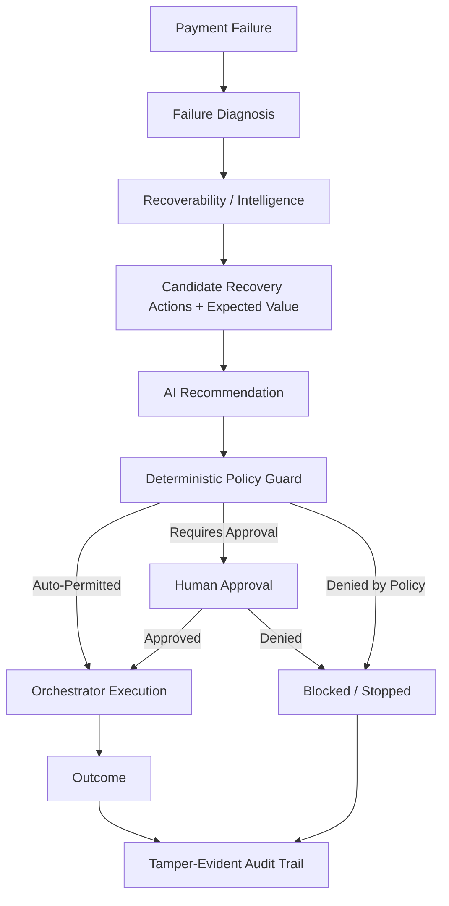

# RevenueGuard

An AI-assisted revenue recovery decision and orchestration platform that recommends, validates, and safely executes payment recovery actions — with deterministic policy control and human approval at every high-stakes step.

---

## Overview

When a payment fails, merchants lose recoverable revenue every day to two failure modes: retrying too aggressively (unnecessary attempts and poor recovery decisions) or retrying too conservatively (recoverable revenue left unrealized). RevenueGuard closes that loop end-to-end — from detecting revenue at risk, through AI-assisted diagnosis and recommendation, to deterministic policy validation, human approval where required, and finally orchestrated execution — with every decision captured in a tamper-evident audit trail.

RevenueGuard is not a chatbot, an LLM wrapper, or a blind retry engine. It's a controlled recovery **decisioning system**: the AI reasons about the best action, but it never has direct financial execution authority. That authority is bounded by a deterministic policy engine and, for high-value or risky actions, a human operator.

---

## Problem Statement

- **Payment failures cause real, recoverable revenue loss.** Not every failure is the same, and treating them uniformly wastes both money and customer goodwill.
- **Blind retrying is not a strategy.** Retrying every failure uniformly can lead to unnecessary attempts and poor recovery decisions, while overly conservative strategies leave recoverable revenue unrealized.
- **Unchecked automation is a risk.** Letting an AI system directly execute financial actions — retries, charges, escalations — without guardrails invites unsafe or unauthorized behavior.
- **Merchants need controlled recovery decisioning**: a system that diagnoses *why* a payment failed, decides *whether* recovery is worthwhile, recommends the *best* action, and only acts within clearly defined, auditable boundaries.

---

## Why RevenueGuard?

RevenueGuard is deliberately **not** just a smarter retry bot. It closes the full loop:

**Detection → Diagnosis → Recommendation → Policy Validation → Approval → Execution → Audit**

The core design principle:

> **AI recommends. Deterministic policy controls. Humans approve high-value or risky actions. The orchestrator executes only what's permitted. Every decision is auditable.**

The AI layer is genuinely useful — it reasons over diagnosis, recoverability, and expected value to recommend the best next action — but it is always subordinate to a deterministic policy layer that cannot be overridden by model output, and to human sign-off when a transaction crosses a defined risk/value boundary.

---

## Core Architecture

The AI recommendation sits *inside* the pipeline, not above it. Nothing the AI suggests reaches execution without passing through the deterministic policy guard, and nothing above the approval threshold executes without a human decision.

---

## How RevenueGuard Makes a Recovery Decision

Each failed payment moves through four distinct layers of decision-making, kept intentionally separate:

1. **AI Recommendation** — Given the failure diagnosis, recoverability signal, and expected-value-ranked candidate actions, the AI layer proposes a recommended action and reasoning.
2. **Deterministic Policy Enforcement** — A rules engine — independent of the AI and non-overridable by it — evaluates the recommendation against hard constraints (e.g. value thresholds, risk limits, cooldowns, consent) and returns an explicit allow, deny, or "requires human approval" result.
3. **Human Authorization** — When policy flags a transaction as high-value or high-risk, a human operator reviews the diagnosis, recommendation, and policy context, then explicitly approves or denies the action.
4. **Orchestrated Execution** — Only actions that clear both policy and (where required) human approval are executed. The orchestrator executes permitted actions and records the outcome.

This separation is what lets RevenueGuard make use of AI reasoning without giving AI financial execution authority.

---

## Safety & Governance

RevenueGuard's safety story is about **controlled AI decisioning**, not a claim of production-grade security. The following governance and safety controls are implemented:

- **Deterministic policy enforcement** — hard rules the AI cannot override
- **Human approval gating** — required for actions above the defined value/risk boundary
- **Kill switch** — halts automated recovery actions
- **Blocked-action recording** — unsafe or policy-denied actions are captured, not silently dropped
- **SHA-256 tamper-evident audit hash chaining** — every recorded decision is chained and verifiable
- **Audit-chain integrity verification** — the chain can be checked for tampering
- **PII masking** — sensitive fields are masked before persistence
- **Static-route / security isolation** — separation between static assets and application routes

These are safeguards around how AI-assisted recommendations are allowed to affect real actions — they are not a claim that the system is "100% secure" or production-hardened.

---

## Human Approval Workflow

When a candidate recovery action crosses the defined value or risk boundary, the transaction enters a **human approval queue** rather than executing automatically. The operator reviewing the queue sees:

- The failure diagnosis
- The AI's recommended action and reasoning
- The expected-value context behind that recommendation
- The deterministic policy engine's decision and rationale

From there, the operator can **Approve & Execute** or **Deny**. Nothing above the approval boundary reaches the orchestrator without this explicit human decision.

---

## Live Demo Workflow

RevenueGuard includes a working, interactive demo built for a 5-minute walkthrough:

1. Open **Overview**.
2. Click **Run Demo Transaction** — a deterministic ₹12,500 failed-payment scenario enters the recovery pipeline.
3. The transaction is diagnosed, a recommendation and expected value are generated, and the policy engine flags it for **human approval**.
4. Navigate to **Approvals** and open the review.
5. Review the failure diagnosis, AI recommendation, expected-value context, and policy decision.
6. Click **Approve & Execute** — the orchestrator executes the permitted action.
7. The transaction status updates.
8. Navigate to **Transactions** and inspect the transaction's full decision journey.
9. Trigger the **blocked scenario** separately — the deterministic policy engine blocks an unsafe action.
10. Open **Safety Center** to see the blocked action and the reason it was prevented.
11. Open **Audit & Governance** and verify the **SHA-256 audit hash chain**, confirming integrity.

This walkthrough is meant to show actual controlled execution — approval, blocking, and audit verification — rather than static analytics.

---

## Dashboard

The frontend is a plain HTML/CSS/JavaScript application (no framework or build step) using hash-based routing across six views:

| Route | Page | Purpose |
|---|---|---|
| `#overview` | **Overview** | Revenue at Risk, Recovered Revenue, Recovery Rate, Net Recovery, Pending Approvals, Blocked Actions, recovery activity, safety controls, and the Operations Demo entry point |
| `#transactions` | **Transactions** | Transaction explorer with search and status filtering, plus per-transaction Decision Journey inspection |
| `#approvals` | **Approvals** | Human approval queue — transaction context, diagnosis, recommendation, expected value, policy decision, Approve & Execute / Deny |
| `#safety` | **Safety Center** | Blocked actions, policy violations, and the reasons actions were prevented — demonstrates the deterministic safety boundary |
| `#audit` | **Audit & Governance** | Audit log, event and hash details, SHA-256 chain verification, and integrity status |
| `#simulator` | **Policy Simulator** | Adjust policy parameters and compare current vs. simulated recovery, approval, and blocking outcomes |

---

## Evaluation

RevenueGuard is benchmarked against a fixed-policy retry baseline on a synthetic benchmark dataset. The evaluation is deterministic and reproducible.

| Metric | Value |
|---|---|
| Total transactions evaluated | 5,000 |
| Total revenue at risk | ₹44,86,319.02 |
| Fixed baseline recovery | ₹22,09,788.88 (49.26%) |
| RevenueGuard AI recovery | ₹21,56,925.34 (48.08%) |
| **Incremental revenue lift** | **-₹52,863.54 (-2.39%)** |
| Net recovery after costs | ₹20,77,609.34 |

These numbers are reported as measured, without adjustment. On this benchmark, RevenueGuard's AI-driven strategy does not currently outperform the fixed retry baseline.

The benchmark therefore provides a transparent measure of the current recovery strategy against a fixed baseline. In addition to recovery performance, the prototype demonstrates controlled decisioning through deterministic policy enforcement, human approval gating, blocked-action handling, and end-to-end auditability.

---

## Testing

**53 tests passing.**

Test coverage spans areas including evaluation, security and adversarial scenarios, security routes, audit chain integrity, the demo workflow, health checks, payments, recovery logic, recovery endpoints, and unit-level components.

---

## Technology Stack

- **Backend**: Python
- **AI/ML**: AI recommendation layer for recovery-action reasoning; expected-value-based candidate action ranking
- **Frontend**: Plain HTML, CSS, and JavaScript (no framework, no build step) with hash-based client-side routing
- **Testing**: Automated test suite (53 tests passing) covering evaluation, security, audit chain integrity, demo workflow, and recovery logic
- **Data / Evaluation**: Synthetic benchmark dataset (5,000 transactions), deterministic and reproducible evaluation pipeline
- **Diagrams**: Mermaid (this document)

---

## MVP Scope & Limitations

- **No authentication is implemented.** The "Merchant Operations Admin" label shown in the dashboard is a **configurable operator display identity**, not an authentication or access-control system. It should not be read as RBAC or login security.
- The evaluation benchmark runs on a synthetic, deterministic dataset — it is not a live-production benchmark.
- The current evaluation result does **not** show a positive incremental lift over the fixed baseline (see Evaluation above).
- Safety and governance controls (policy engine, approval gating, kill switch, audit chaining, PII masking, route isolation) are MVP-level safeguards for controlled AI decisioning — they are not a claim of full production security or of being a certified production payment processor.
- This is a hackathon MVP/prototype, built to demonstrate an architecture and decisioning pattern, not a production payment system.

---

## Future Work

The following are reasonable next steps, **not implemented today**:

- Authentication and role-based access control (RBAC)
- Stronger operator identity and access management
- Production payment-provider integrations
- Richer merchant integrations
- Additional/expanded recovery strategies
- Model monitoring and online learning
- Production-scale observability

---

## Demo

For a live walkthrough, follow the [Live Demo Workflow](#live-demo-workflow) above: Run Demo Transaction → review and approve in the Approvals queue → inspect the transaction's decision journey → trigger the blocked scenario → review it in Safety Center → verify the audit hash chain in Audit & Governance.
